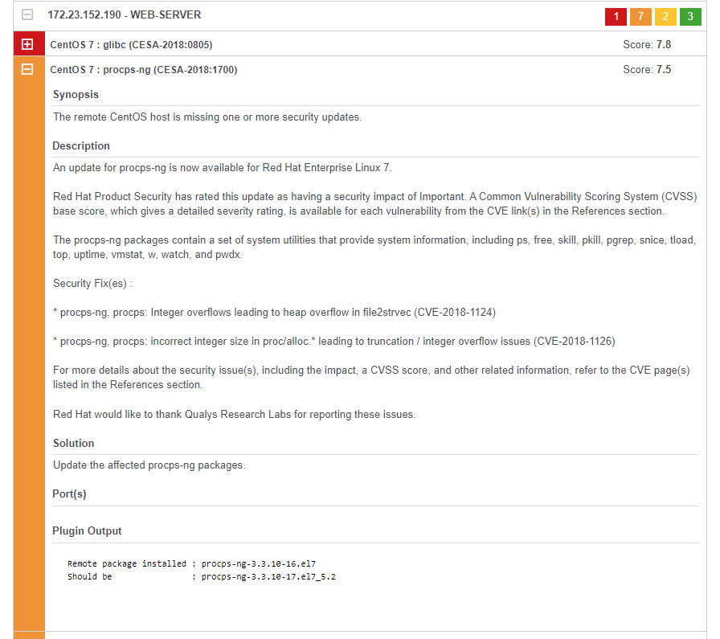

# Vulnerability Scans

Operating system and application vulnerabilities are often the primary cause of a breach of a business's infrastructure. Delivered as part of the UKFast Threat Scan service are on-demand vulnerability scans, which detect any components that require patching or updating and configurations that need changing to ensure security. Detected items are also highlighted with a severity score allowing you to tailor your remediation efforts to the most critical threats.

Internal and external vulnerability scans can be conducted through MyUKFast. Once completed, a detailed online report will be generated, clearly defining any vulnerabilities found. A report can also be generated, containing the top vulnerabilities found in that scan. 

For continued vulnerability monitoring, scheduled scans can be created to regularly scan and detect new vulnerabilities on your solution, ensuring that your infrastructure is always safe and secure.

Once you have the results of your report, you may choose to either manage any necessary patching and updates yourself or request that this is carried out by UKFast engineers during normal business hours.

Shown below is an example vulnerability scan ran on-demand through MyUKFast. In the image below, we can see an overview of this scan report. We can see the amount of critical, high, medium and low vulnerabilities found during the scan. We can also see what server's we have scanned, and the operating system detected by the scanner.

Expanding the drop-down for the first server, we can see all the detected items for that particular servers, along with its corresponding severity level and threat score.

Expanding further into a detected item, we can see exactly what this vulnerability relates to, along with with a synopsis, a detailed description and solutions advice on patching the vulnerability.

