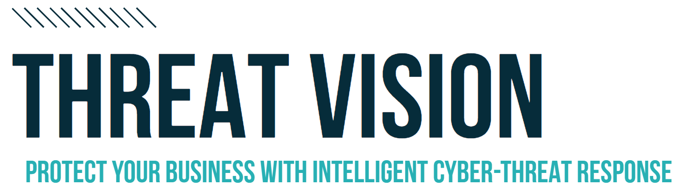

.. meta::
   :title: Threat Vision | UKFast Documentation
   :description: Guidance on Threat Vision from UKFast
   :keywords: security, threat, monitoring, monitoring, scan, surveillance, soc, response, alerts, blocking, hacking, ransomware, protection

=====================================
Threat Vision
=====================================

.. raw:: html

   

.. raw:: html

   

------------

Put your environment's security first, with UKFast's suite of security services offering vulnerability scanning, endpoint monitoring and threat response. Offering a tiered approach, the Threat Vision security stack allows you to expand your security capabilities as you see fit coupled with simple clear pricing to avoid unwanted surprises.

.. toctree::
   :maxdepth: 1

   threatscan/index
   threatsurveillance/index
   threatsoc/index

Threat Scan
##############################

Threat Scan is our base tier, providing a robust, clear and concise vulnerability scanning platform that can be used to hunt down security holes in your environment via external vulnerability scans. Threat Scan allows for unlimited scans to be ran either on demand or on a schedule, allowing around the clock scanning.

Each completed scan is compiled into a clear vulnerability report available via MyUKFast, detailing any detected vulnerabilities, severity scores, vulnerability information and remediation advice allowing you to quickly patch and secure your environment. Scan reports can also be exported as a PDF for offline review.

More information on Threat Scan can be found on our :doc:`/security/threatvision/threatscan/index` documentation: 

Threat Surveillance
##############################

Adding endpoint monitoring and log analysis, Threat Surveillance expands your security solution providing real-time threat detection and alerting via a lightweight software agent(s) installed onto your various endpoints. Through event correlation and analysis, Threat Surveillance can detect when a cyber attack is in progress and trigger automated defences to block the attack. Furthermore, email alerts can be generated when a cyber attack is underway, allowing for real-time insight into your environment's defences.

Protecting your codebase and core system files, Threat Surveillance also provides real-time File Integrity Monitoring that will trigger an alert whenever a monitored file/directory (Requires configuration) is changed, added or deleted. FIM helps to reduce the risk of any unwanted file changes going undetected.

Through an easy to use dashboard and control panel, all data collected through Threat Surveillance is visualised in MyUKFast, along with any further information on any generated alerts.

More information on Threat Surveillance can be found on our :doc:`/security/threatvision/threatsurveillance/index` documentation.

.. raw:: html

   

.. raw:: html

   

Threat SOC
##############################

Outsource your security monitoring personnel with Threat SOC. Rely our team of cyber security professionals to implement patches and remediation found in Threat Scan vulnerability scans, receive and react to your Threat Surveillance alerts with proactive mitigation, give advice and create reports all while being on-hand to answer any security questions and provide support 24/7.

UKFast's team of dedicated Security Engineers and Analysts are available to provide advice on how implement vulnerability patches and further security controls will your specific business needs in mind, working with you to implement an optimal security strategy tailored to your unique needs.

Fully trained and with industry recognised qualifications such as CompTIA Network+, CompTIA Security+ and CompTIA CySA+, leverage our team of analysts to monitor and respond to any alerts generated by Threat Surveillance. 

More information on Threat Surveillance can be found on our :doc:`/security/threatvision/threatsoc/index` documentation.

Compatibility Matrix
##############################

Threat Vision employs a 3 layer approach to it's services. Each security layer builds upon the previous, adding additional security capabilities and features.

**UKFast Hosted Servers**

+---------------------+----------------+----------------+---------------------+-----------------+
| Product             | External Scans | Internal Scans | Endpoint Monitoring | Threat Response |
+=====================+================+================+=====================+=================+
| Threat Scan         | Yes            | Yes            | No                  | No              |
+---------------------+----------------+----------------+---------------------+-----------------+
| Threat Surveillance | Yes            | Yes            | Yes                 | No              |
+---------------------+----------------+----------------+---------------------+-----------------+
| Threat SOC          | Yes            | Yes            | Yes                 | Yes             |
+---------------------+----------------+----------------+---------------------+-----------------+

**Non UKFast Hosted Servers**

+---------------------+----------------+----------------+---------------------+-----------------+
| Product             | External Scans | Internal Scans | Endpoint Monitoring | Threat Response |
+=====================+================+================+=====================+=================+
| Threat Scan         | Yes            | No             | No                  | No              |
+---------------------+----------------+----------------+---------------------+-----------------+
| Threat Surveillance | Yes            | No             | Yes                 | No              |
+---------------------+----------------+----------------+---------------------+-----------------+
| Threat SOC          | Yes            | No             | Yes                 | No              |
+---------------------+----------------+----------------+---------------------+-----------------+ 
   
