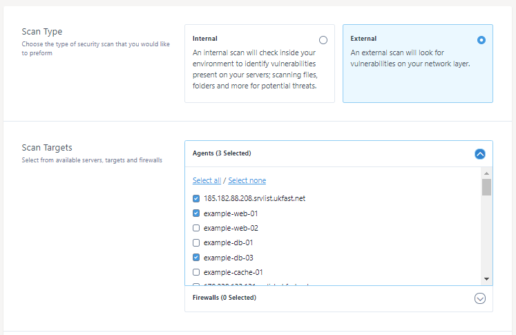
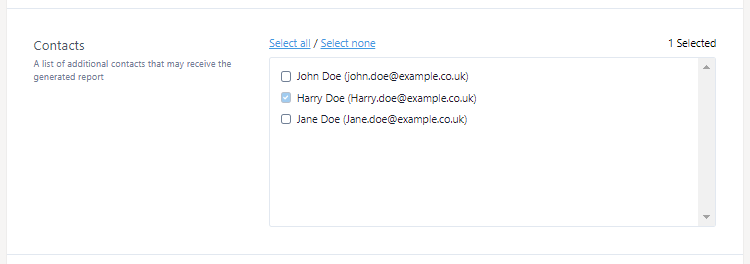
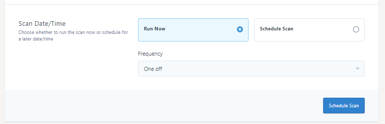
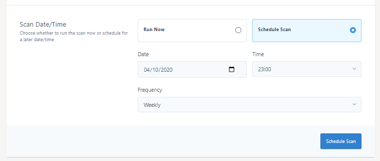

# Launching a scan with Threat Scan

Launching a vulnerability scan with Threat Scan is easy. Starting on MyUKFast, navigate to [Threat Scan > Create a scan](https://my.ukfast.co.uk/threat-scan/create) where you'll be presented with a page where you can configure a new scan.

[1) Scan type](#scan-type)

[2) Contacts](#contacts)

[3) Scan Date/Time](#scan-date-time)


## 1) Scan type

First, select either `Internal` or `External` as your scan type. 

**External Scans**

For external scans, select the external scan type. You'll then be shown a `Scan Targets` section where you can select which targets you'd like to scan. [Targets can be managed in the Threat Scan Targets section](/security/threatvision/threatscan/targets)

Different target types are organised into different sections for your convenience. In the below example, you can see we have a `Agents` section, and `Firewalls` section. Simple click these sections to expand. The sections show for you may vary.

Simply select the check box next to your chosen targets. 




**Internal Scans**

```eval_rst
.. note::
   Internal scans are only available on certain installation type, please see our Threat Version compatibility matrix for more information::doc:`/security/threatvision/threatscan/index`.
```

You don't need to select targets when running an internal scan, all your agents will be included in the scan and provided as one report. 


## 2) Contacts

Once your targets have been selected, you may choose which contact to notify once the scan has completed by selecting the check box next to your chosen contacts.

Additional contacts can be added via the [MyUKFast contacts area](https://my.ukfast.co.uk/account/list-contacts.php)



## 3) Scan Date/Time

You can choose to either launch your scan now or choose a specific date/time to launch the scan. Both options will allow you to set a frequency for when to re-run the scan should you wish, you may choose to run the scan as either a One off, Weekly, Monthly or Quarterly.

**Run Now**

To run the scan now, select the `Run Now` option.

In the below example, a frequency of one off has been set. This will only run this scan one time.



Once configured, press the blue `Schedule Scan` button to save your scan. The scan will now be shown under then `Pending` tab in the scans list. Scans are started in 15 minute intervals, and will be moved to the `Running` tab once started.

**Schedule Scan**

To run the scan at a specific date and time select the `Schedule Scan` option. You'll then be able to select a specific date and time to launch the scan.

In the shown example, a date of 04/10/2020 (a Sunday) has been set and a launch time of 23:00. Additionally, this example shows that a frequency of `Weekly` as been set. This scan will now be launched automatically every Sunday at 23:00 and a new report provided for each scan.



Once configured, press the blue `Schedule Scan` button to save your scan. The scan will now be shown under then `Pending` tab in the scans list. Scans are started in 15 minute intervals, and will be moved to the `Running` tab once started.

```eval_rst
   .. title:: Launching a scan with Threat Scan
   .. meta::
      :title: Launching a scan with Threat Scan | UKFast Documentation
      :description: Launching a scan with Threat Scan
      :keywords: security, threat, monitoring, monitoring, scan, surveillance, soc, response, alerts, blocking, hacking, ransomware, protection, launch, scan
```
