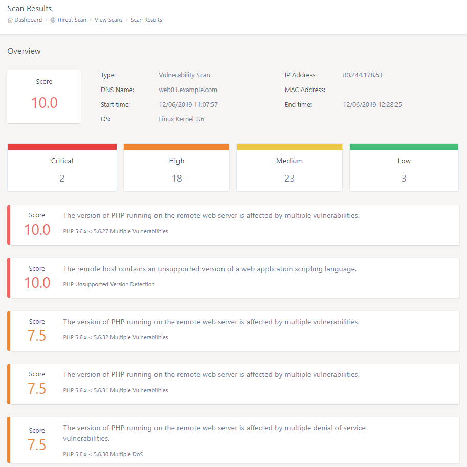
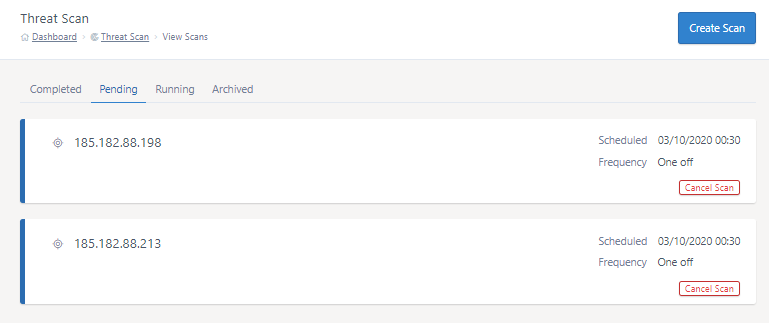

# Managing scans with Threat Scan

All scans ran via the Threat Scan platform can be viewed via MyUKFast under the `Threat Scan > View Scans` section. In this section, you will find 4 tabs:

- Completed - The completed scans tab shows scans that have ran successfully
- Pending - The pending tab shows scans that have been scheduled to run at a later date.
- Running - The running tab shows scans that are currently underway. Note that the scan's results can only be viewed one the scan has completed.
- Archived - Any archived scans can be found in the archived scans tab. Each scan's results will still be viewable.

Each scan listed under the completed and archived tabs will show metadata for each scan for quick reference, including:

- Overall scan score
- Scan target
- Scan status
- Completed date
- The amount of items found

Each scan will be colour coded based off it's overall score.


## Archiving scans

You have the option of archiving a scan by pressing the folder icon towards the right of the scan in the list. This will move the scan to the 'Archived' tab. The results of an archived scans can still be viewed.

This feature allows you to better manage your scans. For example, you could move a scan to the archive once it has been remediated. 

```eval_rst
.. warning::
   Once a scan has been archived, it cannot be removed from the archive.
```

## Viewing scans

Completed or archived scan scans be can viewed to show a detailed report of the scan's outcome. In the example below, you can see that this particular scan has received an overall security score of 10 and has highlighted a number of critical, high, medium and low vulnerabilities. The scan will also attempt to pull information such as the DNS name, operating system and target IP address.

```eval_rst
.. note::
   External scans may not allways accurately show the target's operating system, this is expected behaviour. As external scans don't have direct access into the target, the scanner makes a guess as to the running OS based of various factors.
```

All vulnerabilities found by the scan will be listed in the report, ordered by each vulnerability's severity score. 



Clicking on a scan item will expand it to show more information about that particular vulnerability, as show below. In this example, you can see how the scan has provided a description of the vulnerability, a severity score, the port that the affected service was found on, the scanner's output and a proposed solution to patch the vulnerability.


## Cancelling pending scans

Pending scans can be cancelled from the `Pending` section by pressing the red `Cacnel scan` button next to the scan. This will remove a scan from the schedule.




```eval_rst
   .. title:: Managing scans with Threat Scan
   .. meta::
      :title: Managing scans with Threat Scan | UKFast Documentation
      :description: Managing scans with Threat Scan
      :keywords: security, threat, monitoring, monitoring, scan, surveillance, soc, response, alerts, blocking, hacking, ransomware, protection, launch, scan
```
