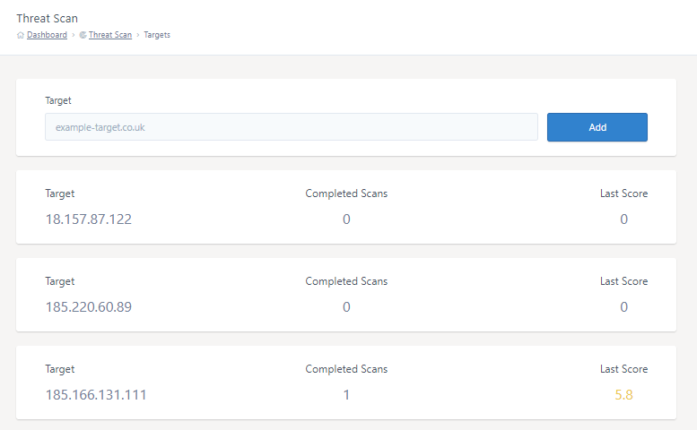
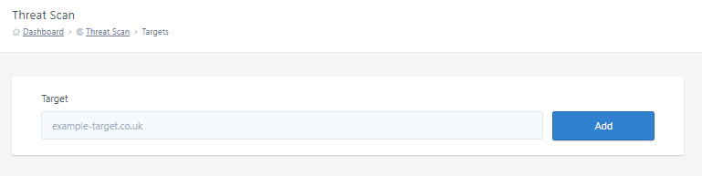
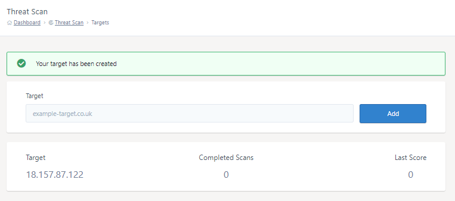

# Configuring Targets

Before Threat Scan vulnerability scans can be launched you will need to add some targets. These configured targets can then be selected when running a vulnerability scan.

## Existing targets

You can view your existing targets on MyUKFast [Threat Scan > Targets](https://my.ukfast.co.uk/threat-scan/targets) paired with information based of previous scans, such as how many scans have been ran and the latest scan vulnerability score for that target. This helps you to manage your scans, highlighting which targets may have outstanding patches.



## Adding new targets

Navigate to [Threat Scan > Targets](https://my.ukfast.co.uk/threat-scan/targets) to add targets to Threat Scan.

On this page you'll be able to enter a domain name or IP address to add as a target. Adding a target will consume a Threat Scan credit.



Once added, your new target will be visible on the targets page and selectable when creating a scan.



```eval_rst
   .. title:: Configuring Targets with Threat Scan
   .. meta::
      :title: Configuring Targets with Threat Scan | UKFast Documentation
      :description: Configuring Targets with Threat Scan
      :keywords: security, threat, monitoring, monitoring, scan, surveillance, soc, response, alerts, blocking, hacking, ransomware, protection, launch, scan
```