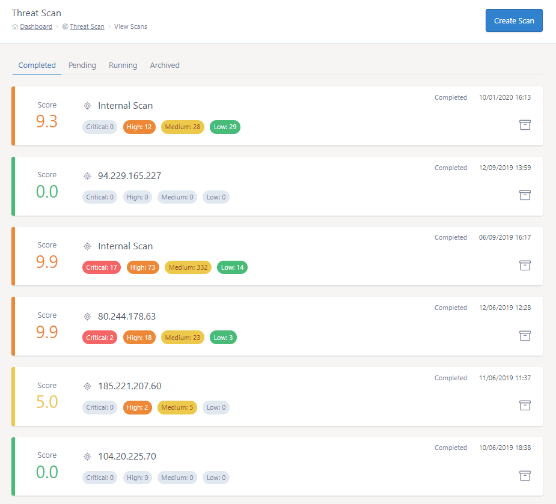

# Managing scans with Threat Scan


## Viewing scans 

All scans ran via the Threat Scan platform are be viewed via MyUKFast under the Threat Scan > View Scans section. In this section, you will find 4 tabs:

**Completed**

The completed scans tab shows scans that have ran successfully

**Pending**

The pending tab shows scans that have been scheduled to run at a later date.

**Running**

The running tab shows scans that are currently underway. Note that the scan's results can only be viewed one the scan has completed.

**Archived**

Any archived scans can be found in the archived scans tab. Each scan's results will still be viewable.

---

Each scan listed under the completed and archived tabs will show metadata for each scan for easy quick reference, including:

- Overall scan score
- Scan target
- Scan status
- Completed date
- The amount of items found
  - Critical
  - High
  - Medium
  - Low

Each scan will be colour coded based off it's overall score.




## Archiving scans

You have the option of archiving a scan by pressing the folder icon towards the right of the scan in the list. This will move the scan to the 'Archived' tab. The results of an archived scans can still be viewed.

This feature allows you to better manage your scans. For example, you could move a scan to the archive once it has been remediated. 

```eval_rst
.. warning::
   Once a scan has been archived, it cannot be removed from the archive.
```


```eval_rst
   .. title:: Viewing scans with Threat Scan
   .. meta::
      :title: Viewing scans with Threat Scan | UKFast Documentation
      :description: Viewing scans with Threat Scan
      :keywords: security, threat, monitoring, monitoring, scan, surveillance, soc, response, alerts, blocking, hacking, ransomware, protection, launch, scan
```
