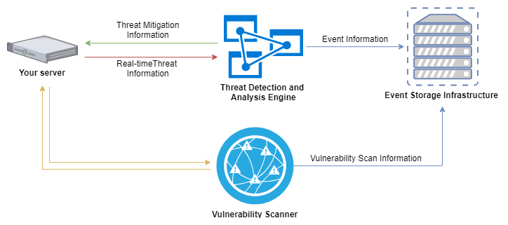
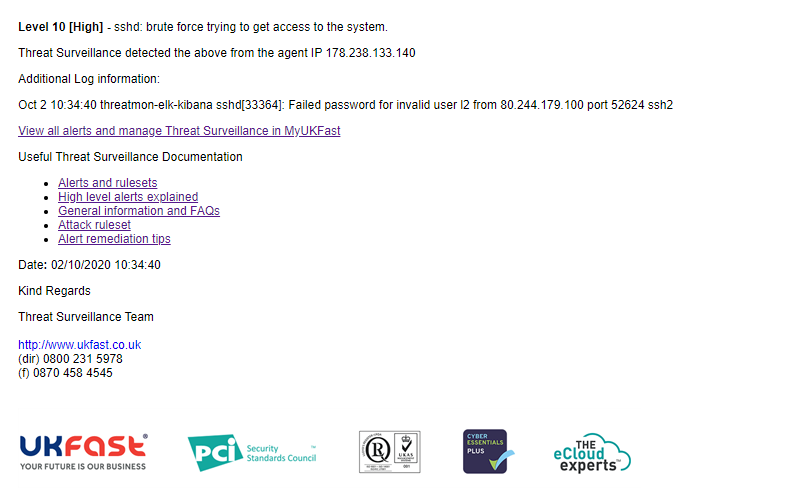
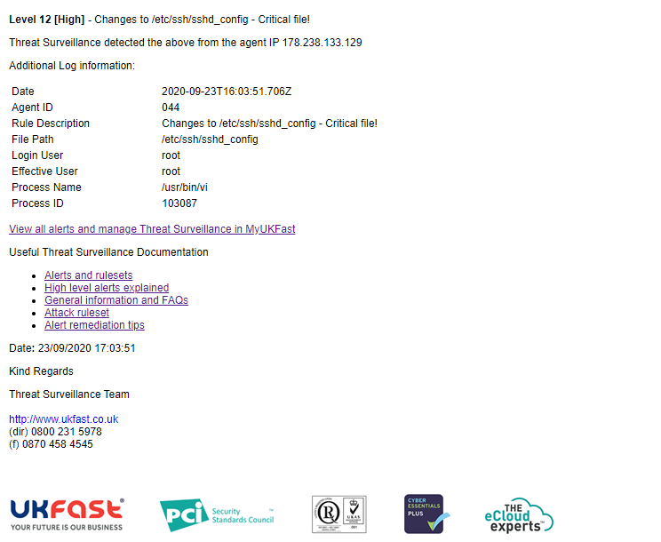

# How does Threat Surveillance work?

Once Threat Surveillance agents are installed on your server(s) they will be automatically configured to deliver the following services.

<div style="text-align: center;">



</div>

## Threat Detection, Attack Protection and log file collation

UKFast's Host-Based Intrusion Detection (HIDS) solution, Threat Surveillance, will monitor numerous aspects of your infrastructure to detect suspicious activity. UKFast provide a full list of log locations to be monitored and event types that are collected as standard. Log locations can be customized for your environment, you can work with a UKFast security analyst to find the optimal configuration for your solution.

### Threat Detection

UKFast have created rule sets which analyse log files from all core technologies such as syslog, MySQL, FTP, Postfix, SSHd, CPanel, MS-auth, Apache, Nginx, PHP and more. These events are parsed through our 2,000+ rules, should a high-level event trigger, an alert will be sent to a nominated email address (or multiple contact addresses) for you to investigate.

If you have the additional Threat Response service then the UKFast security team will pro-actively investigate the alert and consult with you with recommended mitigating actions.

Additionally, you can [view a dashboard](/security/threatvision/threatsurveillance/alerts.md), highlighting all activity detected through MyUKFast.

Example rules often triggered:
1.    Multiple attempts to log in to a server followed by a successful authentication
2.    Attempts to escalate account privileges to that of a superuser
3.    SQL Injection attacks
4.    XSS (Cross-Site Scripting) Attacks

Shown below is an example Threat Surveillance email alert. In the below alert, we can see that a SSH brute force attack, a level 10 alert has been detected.

<div style="text-align: center;">



</div>

### Active Response

Providing real-time protection against incoming attacks, UKFast's Threat Surveillance solution can block attacking IP addresses, through the use of a host-based firewall, such as IPTables (Linux) or Windows firewall. This protection, called Active Response, will block an attacker for 30 minutes, afterwards, removing the block. Should the attacker continue, the IP address is placed on a global blocklist for 30 days. This global blocklist spans across all customers protected with Threat Surveillance, enabling a wide area of protection, from a wide and varied attack base.

### Log collation

As per PCI-DSS requirements, all collected logs are securely stored on our Threat Surveillance infrastructure for 12 months. The last 3 months of this data is readily accessible and can be accessed through your MyUKFast dashboard.

## File Integrity Monitoring (FIM)

As part of your setup of Threat Surveillance, you can provide UKFast with a list of core system files and directories for which you wish to have [alerts raised](/security/threatmonitoring/alerts) if any changes are made. This is known as File Integrity Monitoring (FIM). A common use of FIM is to ensure payment gateways or redirect pages are not manipulated to divert customer payments elsewhere.

FIM works by taking a hash of each file or utilizing audit processes such as 'AuditD' in Linux and the 'Microsoft Windows audit system', any changes to these files are alerted with the time, date, process and user who made the changes.

File Integrity Monitoring alerts are accessible through MyUKFast, under the 'Alerts' sections on your Threat Surveillance dashboard. Shown below is an example FIM alert in MyUKFast, here we can see what file has changed, when, what process changed the file and exactly what has changed.

<div style="text-align: center;">




</div>

```eval_rst
   .. title:: How Threat Surveillance Works
   .. meta::
      :title: How Threat Surveillance Works | UKFast Documentation
      :description: Guidance relating to UKFast's Threat Surveillance solution
      :keywords: Threat Surveillance, alerts, security, compliance, rules, rulesets, ukfast, hosting, file integrity monitoring, rootkit, detection, vulnerability scan, scans, hids, intrusion detection
```
