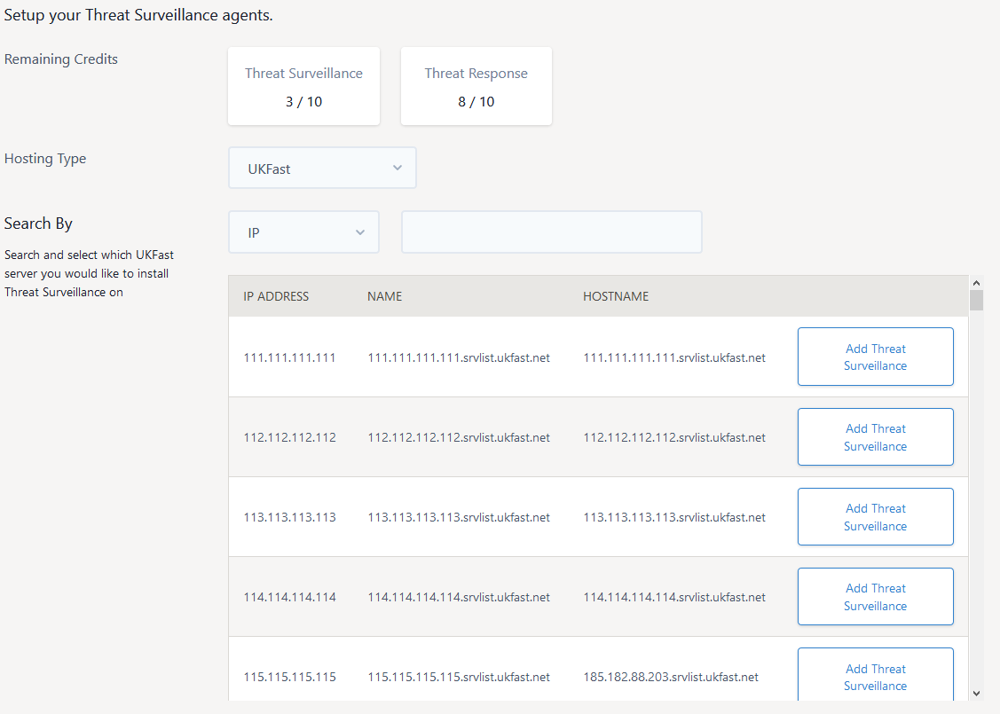
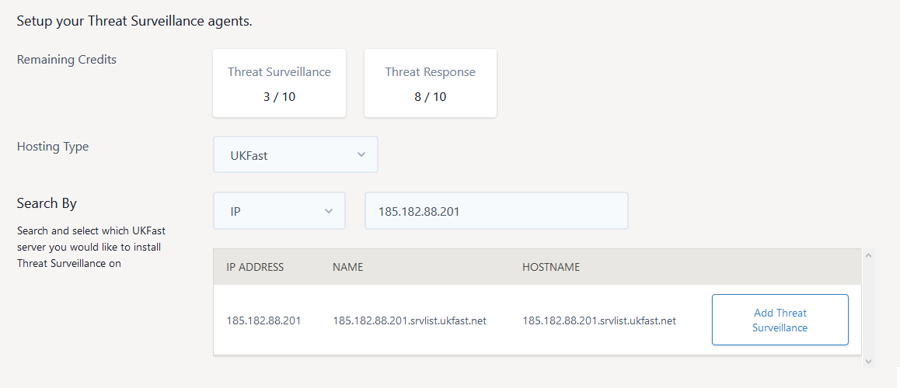

# Installing Threat Surveillance  on a UKFast hosted server

```eval_rst
.. note::
   This documentation is for setting on a UKFast hosted server with Threat Surveillance. Instructions on how to install Threat Surveillance and Threat SOC on a non-UKFast hosted server can be found in our :doc:`non-ukfast-install` documentation.
```

Threat Surveillance and Threat SOC can be installed on servers that are hosted with UKFast, allowing you to secure and protect all parts of your UKFast hosted IT infrastructure via one centralised threat defence platform.

To begin, log into MyUKFast and visit the [Threat Surveillance new agent configuration page](https://my.ukfast.co.uk/threat-monitoring/configuration) then select `UKFast` from the `Hosting Type` drop-down option.


```eval_rst
.. note::

   Threat Surveillance only supports a specific set of operating systems and configurations. Please make sure your server meets the minimum required specification and required requirements as defined in our :doc:`system-requirements` documentation.

```

## 1) Select a server

Firstly, using the list shown on the configuration page, select the server you want to install with Threat Surveillance by pressing the blue "Add Threat Surveillance" button, as shown below.



You may filter the list of shown servers by the `IP Address`, `Name` or `Hostname` of the server. Simply select the search type using the "Search By" drop-down and enter your search criteria ion the next box provided, as shown below.



Adding Threat Surveillance to a server will consume a Threat Surveillance credit. Your remaining Threat Surveillance and Threat SOC credits are shown at the top of the configuration page.


## 2) Configure and install

Once your chosen server(s) are selected, they will appear towards the bottom of the page in an "Install On" section. 

You can remove a server from the "Install On" list via the red bin icon.

If you would also like to install Threat SOC into any of these selected servers, select the "Threat SOC" checkbox next to the server. Doing this will consume a Threat SOC credit, as shown below.


Once you are happy with your selection, press the "Install Agent" button to launch the automated installation process.

When the servers have been successfully queued for automation, you will see a green success message like the below.


The automated installation process normally takes 5 minutes per server. Once the installation process has completed you will start to see data for the server in your Threat Surveillance dashboard, view alerts and run vulnerability scans.

If you do encounter any issues during installation, please get in contact with [UKFast support](https://my.ukfast.co.uk/pss/create).

## 3) Setup email contacts

To receive email alerts for suspicious events, you will need to configure email alerts via MyUKFast. To do this, go to the [Alerts Manager section](https://my.ukfast.co.uk/alerts-manager/index.php) under "My Account", as shown below.


On the "Server " tab, you will see a table of contacts and the types of alerts they have been configured to receive. 

To set a contact to receive Threat Surveillance alerts, press the letter icon next to their name under the Threat Surveillance column and then press the "Save Changes" button, an example is shown below.


```eval_rst
   .. title::  Installing on a UKFast server
   .. meta::
        :title: Installing Threat Surveillance on a UKFast server | UKFast Documentation
        :description: Guidance on installing UKFast's Threat Surveillance on a non-UKFast server
        :keywords: threat surveillance, alerts, security, compliance, rules, rulesets, ukfast, hosting, file integrity monitoring, rootkit, detection, vulnerability scan, scans, hids, intrusion detection, set up
```
